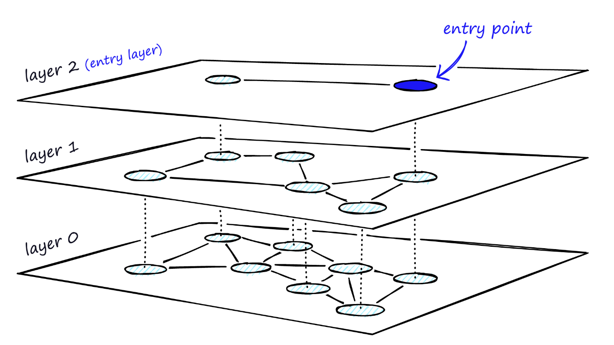
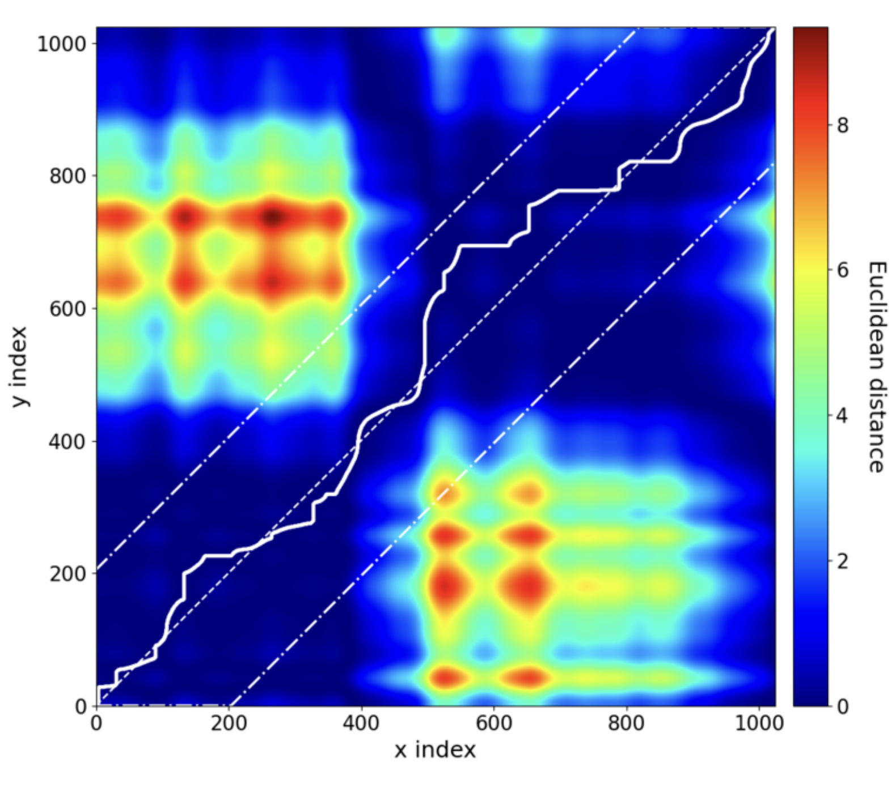

# Algorithms

Things that I find interesting and/or useful.

## Hierarchical Navigable Small Worlds (HNSW)

- extremely fast vector similarity search ((approximate) nearest neighbor) algorithm
- combines probability skip lists with navigable small worlds (NSW)
  - probability skip lists are made of multiple layers of linked lists, where the top layers are more coarsely connected (i.e., longer connections, faster to traverse, less accurate) and the lower layers are more finely connected
  - navigable small worlds are graphs with vertices separated by a combination of short and long links
    - (logarithmic) search process is done greedily: start at some entry vertex and keep traversing to the connected vertex which is closest to the search point
    - stop when no connected vertices are closer to the search point than the current vertex (local minimum)
    - can increase network connectivity (number of connections per node) to increase recall at the cost of speed
- HNSW use the layer structure of probability skip lists, and in each layer there is a NSW
- 
- paper: {cite:t}`Malkov2020`, FAISS: {cite:t}`Johnson2017`, <https://www.pinecone.io/learn/hnsw>

## Dynamic time warping (DTW)

- distance metric between time series that allows for non-linear warping
- does a local (in a window) warping (shrink/stretch) of one time series to best fit the other
- to make a DTW alignment, need to calculate all pairwise Euclidean distances between observations in the two time series, and then find the path in this matrix with the lowest total cost
- 
- the solid white line in the figure above shows the DTW alignment path, the dashed white line down the diagonal shows the Euclidean alignment path (1-1 index-wise mapping), and the dotted dashed lines around the diagnoals show a 20% warping window constraint (which helps ensure realistic alignments by preventing e.g., one particular point at the beginning of one time series being matched with a point at the very end of the other time series, or a point in one time series being matched to multiple points in the other time series)
- <https://www.informs.org/Publications/OR-MS-Tomorrow/A-measure-of-distance-between-time-series-Dynamic-Time-Warping>

```{bibliography}
  :filter: docname in docnames
```
