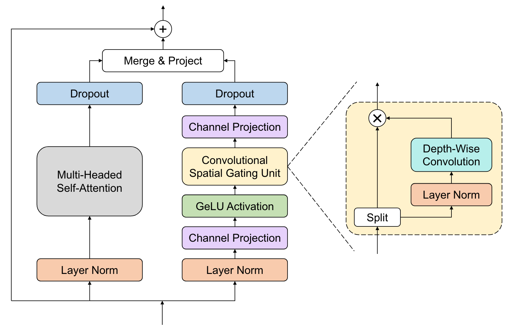

# Attention

## Attention is all you need {cite:p}`Vaswani2017`

- attention is a mechanism that allows a model to focus on relevant parts of the input
  \begin{align}
  \text{Attention}(Q, K, V) = \text{softmax}(\frac{QK^T}{\sqrt{d_k}})V
  \end{align}
- attention maps can be pulled out of the model after the softmax and visualized to see which parts of the input the model is focusing on
- multi-head attention (MHA) splits the input into multiple heads and applies attention to each of them in parallel, then concatenates the outputs and projects them back down to the original dimension, allowing you to focus on information from multiple representation subspaces at once
- self-attention is attention where $Q$, $K$, and $V$ are all the same
- attention is permutation invariant, so you need to add positional encodings to the input if you want to preserve order
- implementation in PyTorch: use `F.scaled_dot_product_attention`, which attends over the second last dimension (the other dimensions can be whatever you want)
- standard flow: embed input, add positional encodings, pass through Transformer blocks, pass through output head

## Attention variants

- ReAttention {cite:p}`Zhou2021`: mix the attention head outputs with a linear layer (after softmax) before multiplying with values, which solves the problem of attention collapse, which is when (deep) ViTs learn attention maps that are similar to each other and so do not scale well with depth
  \begin{align}
  \text{ReAttention}(Q, K, V) = \text{Norm}(\theta^T(\text{softmax}(\frac{QK^T}{\sqrt{d_k}})))V
  \end{align}
- Parallel attention {cite:p}`Touvron2022`: instead of stacking Transformer layers sequentially, you can run multiple (two is the recommendation) of them in parallel
  <!-- prettier-ignore -->
  \begin{align}
  \mathbf{x'} &= \text{MHA}_1(\mathbf{x}) + \text{MHA}_2(\mathbf{x})+ \mathbf{x} \\
  \mathbf{x''} &= \text{MLP}_1(\mathbf{x'}) + \text{MLP}_2(\mathbf{x'})+ \mathbf{x'} \\
  \end{align}
- LayerScale {cite:p}`Touvron2021a`: apply diagonal weight matrices $W_{MHA}$ and $W_{MLP}$ to the output of the MHA and MLP layers in a transformer block (or, do a per-channel multiplication of the outputs before adding the residual connection), which improves training dynamics and allows for continued improvement when adding more layers to a ViT
  <!-- prettier-ignore -->
  \begin{align}
  \mathbf{x'} &= \mathbf{W}_{MHA} \, \text{MHA}(\mathbf{x}) + \mathbf{x} \\
  \mathbf{x''} &= \mathbf{W}_{MLP} \, \text{MLP}(\mathbf{x'}) + \mathbf{x'} \\
  \end{align}
- Branchformer {cite:p}`Peng2022`: replace the MLP with a convolutional gating MLP (cgMLP), which consists of a depth-wise convolution and linear gating, then merges the MHA and cgMLP outputs by concatenating them and linearly projecting down to the output dimension
  
- Macaron net {cite:p}`Lu2019`: instead of MHA and then MLP, do half an MLP, then MHA, then the other half of the MLP, which improves performance
  <!-- prettier-ignore -->
  \begin{align}
  \mathbf{x'} &= \frac{1}{2}\text{MLP}_1(\mathbf{x}) + \mathbf{x} \\
  \mathbf{x''} &= \text{MHA}(\mathbf{x'}) + \mathbf{x'} \\
  \mathbf{x'''} &= \frac{1}{2}\text{MLP}_2(\mathbf{x''}) + \mathbf{x''} \\
  \end{align}
- E-Branchformer {cite:p}`Kim2022a`: merge global (MHA) and local (cgMLP) branches by concatenating them and then applying a depth-wise convolution with a residual connection before projecting back down
  \begin{align}
  \mathbf{x'} &= \text{Concat}(\text{MHA}(\mathbf{x}), \text{cgMLP}(\mathbf{x})) \\
  \mathbf{x''} &= \text{DwConv}(\mathbf{x'}) + \mathbf{x'} \\
  \mathbf{x'''} &= \mathbf{W} \, \mathbf{x''}
  \end{align}

# Vision Transformers

## Vision Transformers {cite:p}`Dosovitskiy2021`

- ViTs are Transformers applied to images by splitting the image into patches, flattening them into a sequence of patches, embedding each patch into some higher dimensional space, then applying a standard transformer to the sequence
- ViTs have much less inductive bias than CNNs, and spatial relations are learned through the positional embeddings, so ViTs tend to need more data to train
- MLP layers are local and translationally equivariant, and the self-attention layers are global

## Axial attention {cite:p}`Ho2019`

- axial attention works efficiently on high dimensional arrays (e.g., 3 spatial dimensions) by splitting the sequence into multiple axes and applying attention to each axis in parallel rather than patching the array (which quickly becomes unfeasible with $N^2$ scaling in high dimensions)
- implement by reshaping the input to put the axis you want to attend over in the second last position, then applying standard attention, then reshaping the input back, and repeating for each axis you want to attend over, and summing all the inputs

# Pre-training

## Emergent properties in self-supervised vision transformers {cite:p}`Caron2021`

- introduces DINO (self-distillation with no labels), which produces representations containing valuable segmentation information that can be used directly with a k-NN classifier (no fine-tuning or linear classifier) to produce high accuracy predictions on ImageNet
- self-supervised learning process:

1. create a student and a teacher network with the same architecture but different initializations
2. given an image, produce global views (random crops) and local views (random patches) of the image
3. give the global views to the teacher and all views to the student, and make them predict softmaxes over $K$ dimensions
4. compute the cross-entropy loss between the student and teacher softmaxes and backpropagate through the student only
5. update the teacher by an exponential moving average (EMA) of the student weights $\theta_t \leftarrow \alpha \theta_t + (1 - \alpha) \theta_s$

- applying an (updating) centering and sharpening (with a temperature parameter on the softmax) to the teacher softmaxes prevents collapse (putting all probability in a single dimension or going to the uniform distribution)

```{bibliography}
  :filter: docname in docnames
```
